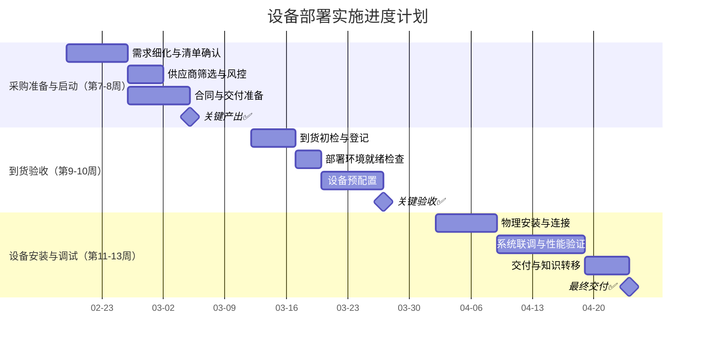

```mermaid
gantt
    title 设备部署实施进度计划
    dateFormat  YYYY-MM-DD
    axisFormat %m-%d

    section 采购准备与启动（第7-8周）
    需求细化与清单确认       :a1, 2025-02-19, 7d
    供应商筛选与风控         :after a1, 4d
    合同与交付准备           :2025-02-26, 7d
    关键产出✅               :milestone, 2025-03-05, 0d

    section 到货验收（第9-10周）
    到货初检与登记           :2025-03-12, 5d
    部署环境就绪检查         :2025-03-17, 3d
    设备预配置               :2025-03-20, 7d
    关键验收✅               :milestone, 2025-03-27, 0d

    section 设备安装与调试（第11-13周）
    物理安装与连接           :2025-04-02, 7d
    系统联调与性能验证       :2025-04-09, 10d
    交付与知识转移           :2025-04-19, 5d
    最终交付✅               :milestone, 2025-04-24, 0d
```