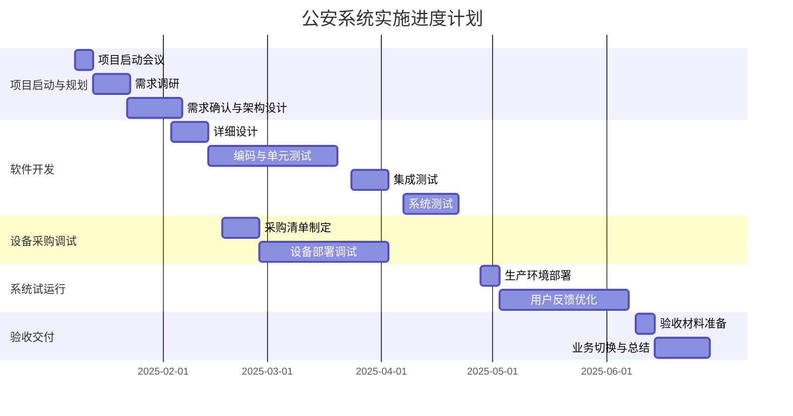

```mermaid
gantt
    title 公安系统实施进度计划
    dateFormat  YYYY-MM-DD
    axisFormat %Y-%m-%d
    
    section 项目启动与规划
    项目启动会议        :a1, 2025-01-08, 5d
    需求调研            :after a1, 10d
    需求确认与架构设计  :2025-01-22, 15d
    
    section 软件开发
    详细设计           :dev1, 2025-02-03, 10d
    编码与单元测试     :after dev1, 35d
    集成测试           :2025-03-24, 10d
    系统测试           :2025-04-07, 15d
    
    section 设备采购调试
    采购清单制定       :equip1, 2025-02-17, 10d
    设备部署调试       :after equip1, 35d
    
    section 系统试运行
    生产环境部署       :run1, 2025-04-28, 5d
    用户反馈优化       :after run1, 35d
    
    section 验收交付
    验收材料准备       :final1, 2025-06-09, 5d
    业务切换与总结     :after final1, 15d
```